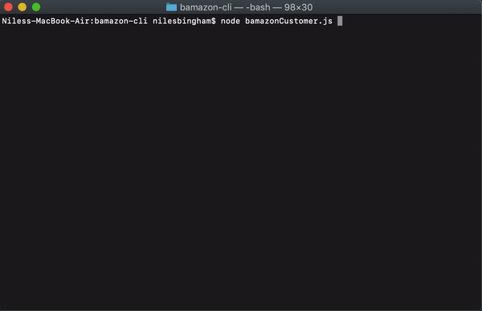
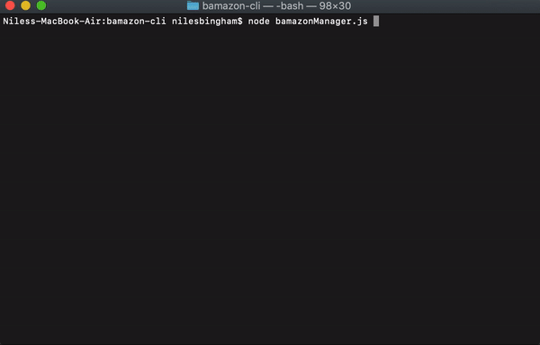
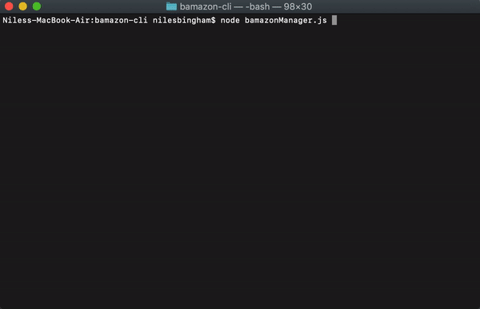
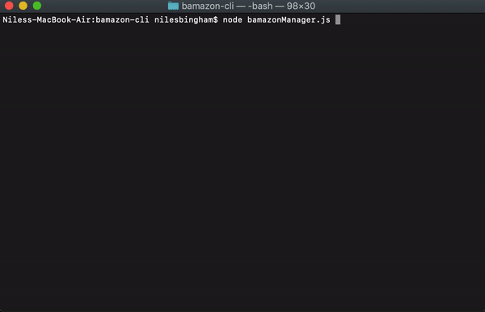

# 
Bamazon-CLI

## App Visuals

Customers Screen

Manager View Products

Manager Low Inventory

Manager Add Inventory

Manager Add New Product

Supervisors Screen

## Overview

Bamazon-cli is a `node` command line app that uses a `mySQL` database to view and update products, "_purchase_" products.

## How To Use

Initialize the app by running `npm install` or `npm i` to download all the files needed. Then start by using `node` followed by the desired file `bamazonCustomer.js`, `bamazonManager.js`, or `bamazon.Supervisor.js`.

1. Customer

   - When the customer file is selected the terminal will display the list of products stored in `mySQL` database.

   - The user is then prompted to select the desired product by it's _ID_ and the quantity desired.

     - When transaction is complete the total amount owed will be displayed, the database will update to reflect the quantity subtracted and the sum of the product sales.

2) Manager

   - With the manager file selected the terminal will display a list of options for the user.

     - **View Products** will display every product in the database along with its department, stock, and the sum of all product sales.

     - **View Low Inventory** will display every product that has a stock quantity of 50 or less along with its department.

     - **Add Inventory** will display a list of the products that has 50 or less to choose from, then after selected the user will be able update the stock quantity.

     - **Add New Product** will prompt the user to input the information needed to populate and update the database.

3) Supervisor

   - When supervisor is selected the terminal will display a list of options for the user.

     - **View Product Sales** Displays a table with the department name, overhead costs, sales, and profit.

     - **Create New Department** Will prompt the user to fill out information on the desired new department.
